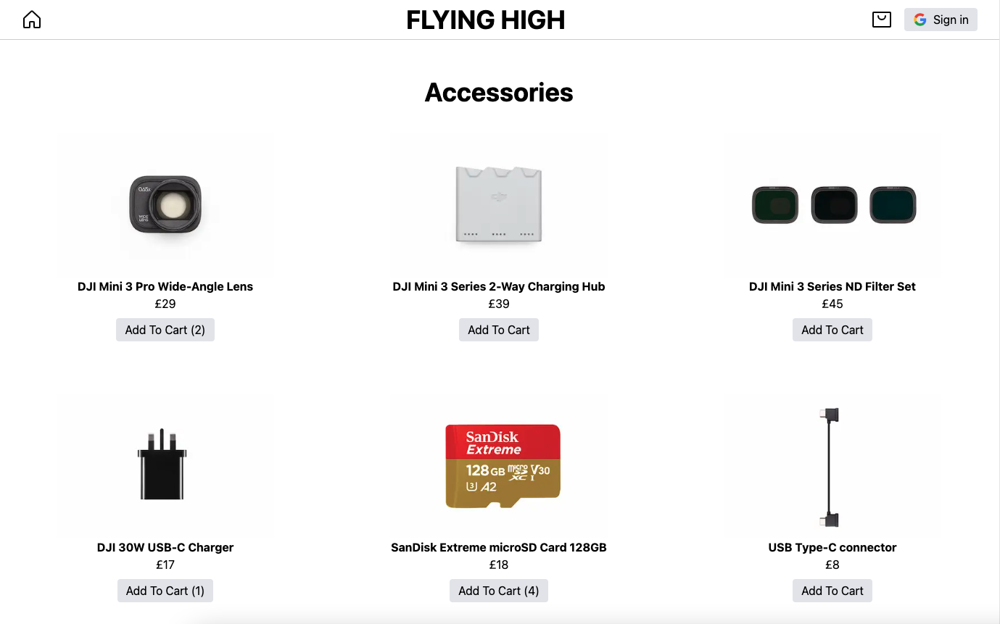
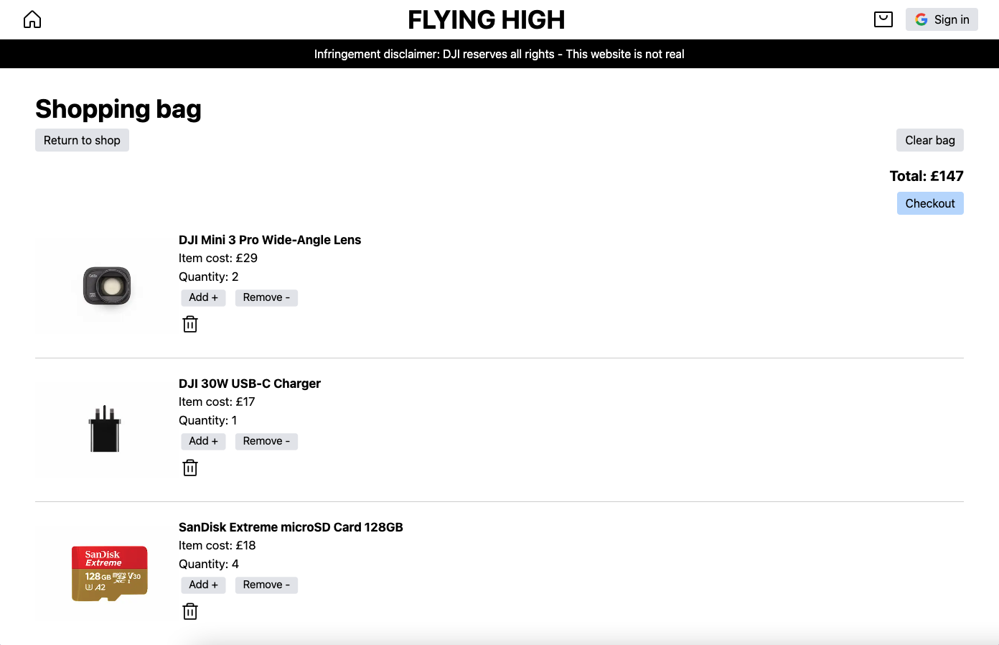
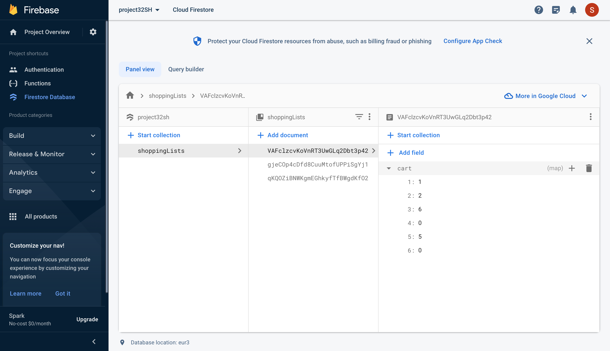

## Description
**This application is deployed on the following link**
- link

This application serves as an interview project assignment. It is not a functional e-commerce website.

I have chosen to make the theme of the website about drone flying as it's a personal hobby of mine. I have added my own image taken with my DJI Mini 2 drone as the hero image.

**I have fully completed the project assignment requirements which are**

Shopping List Application
- User must be able to add an item to the shopping list
- User must be able to view their whole shopping list
- User must be able to delete an individual item from the shopping list
- User must be able to delete their entire shopping list, with a single button click (without going and deleting each individual item one by one)
- Each user must be able to login with their Google account and their shopping list must persist between their logins

**How user shopping list data is stored and how persistence works in this application**
- If the user logs in while there are items in the local shopping bag already, the local shopping bag is merged with the shopping bag on the database
- If the user logs in while there are no items in the local shopping bag, what is returned is the shopping bag on the database if there is data stored for that user
- When the user logs out, the local shopping bag is set to its default value (0)

**Technologies I've used in this application**
- App built with Next.js
    - Context API used to manage state
- Firebase Authentication used to authenticate the user
- Firebase Firestore (database) used to store the user's shopping list
- Tailwind CSS to style

**How this application can be further improved**

If I was to continue building this application, I would implement:
- Testing
- Add local storage to persist the shopping bag for users who don't sign in
- Make the website fully responsive

## Installation
There are no prerequisites required to run this application on a modern web browser.

## Application deployed

## Credits
Author: Shohidul Shah Hoque